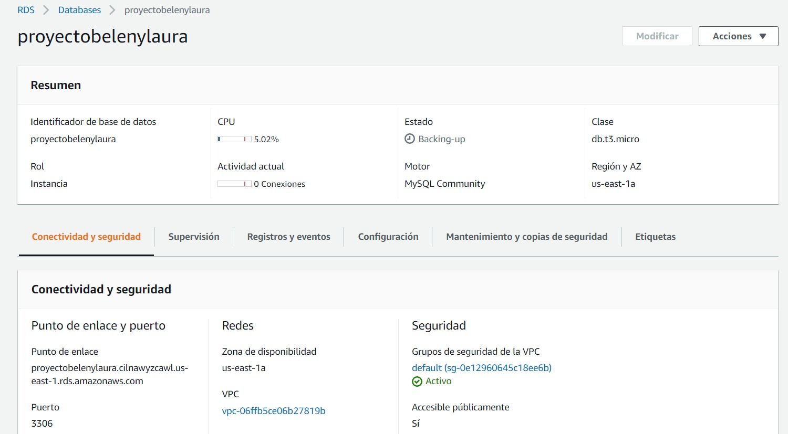
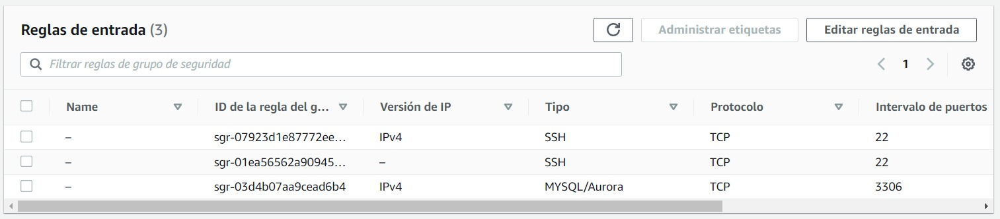
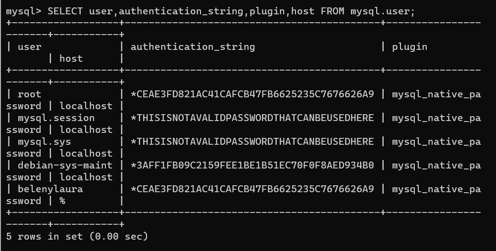

# Práctica 3.9: Despliegue web con bases de datos en AWS. Nivel básico.

## RDS
- Creamos un RDS como de costumbre y le ponemos de base de datos MySql. Le pondremos las reglas de entrada el puerto 3306 para poder trabajar con MySql
  
  

## EC2
- Creamos una ec2 limpia para evitar errores y posibles problemas en otros trabajos posteriores. Le pondremos nombre, seleccionaremos el sistema operativo, que en nuestro caso sera un ubuntu 18.04, dejaremos que cree un grupo de seguridad nuevo y le daremos a lanzar instancia, sino tenemos errores nos llevara directamente a la instancia que se estara iniciando. 
- Una vez creada nos conectaremos por medio de ssh con este comando: ssh -i "belenylaura.pem" ubuntu@ec2-100-25-185-86.compute-1.amazonaws.com, en cada máquina el comando sera diferente, solo tienes que irte a la pestaña conectar y darle donde pone conexión por ssh.
- Dentro de la consola lo primero que haremos sera instalar apache para poder visualizar las páginas web. La documentacion que he seguido para la instalación es esta [Instalar apache en ubuntu 18.04](https://www.digitalocean.com/community/tutorials/como-instalar-el-servidor-web-apache-en-ubuntu-18-04-es). Despues de instalar apache miraremos si se visualiza la página, para ello usaremos la ip de la EC2. Como la ip cambia cada vez que se inicia la ec2, he asociado una ip elastica a la máquina para que siempre tenga esa ip y pueda acceder a ella sin problema. Mi ip para visualizar la página web es 100.25.185.86.
- Ya que tenemos funcionando apache nos iremos a la instalación de MySql, seguiremos los pasos que nos indica esta página [Instalacion de mysql en ubuntu 18.04](https://www.digitalocean.com/community/tutorials/como-instalar-mysql-en-ubuntu-18-04-es)
- Modificamos el usuraio root para que no tengamos fugas de seguridad y creamos el usuario belenylaura  que nos servira para conectar workbench con la ec2. Para ello usaremos la ip a la hora de configurar la conexion de workbench. Dentro de workbench meteremos el scritp sql que nos ha proporcionado la profesora para crear la base de datos delegado. . 
- Metemos las reglas de entrada para poder acceder a la ec2 desde cualquie ip. .
- Por ultimo modificaremos el rol del iam y descargaremos los datos de la s3 en la carpeta html de la ec2

- Visualizaremos la página web de la ec2 usando la ip elastica proporcionada anteriormente 

## S3
En primer lugar hemos creado un nuevo nuevo bucket con el nombre practica3.BelenYLaura. Dejamos la ubicacion que nos viene por defecto. No tocamos nada hasta llegar a la parte BLoqueo todo el acceso público y aceptamos el problema que sale para poder crearlo 
 
Una vez creamo nos metemos dentro para poder añadir las carpetas que luego mostraremos en la EC2.
Para ello nos descargamos los documentos que nos a proporcionado la profesora, como es un archivo .zip lo descomprimimos y subimos los archivos que estan dentro de la carpeta. Este paso es importante ya que si no subimos los archivos como se debe nos puede dar futuros errores.
Le damos a cargar y si no nos da errores es que esta bien configurado.

Ahora nos vamos a la configuracion del bucket y nos vamos a la parte de propiedades y en la parte de abajo donde nos dice alojamiento web pulsamos. 
Lo configuramos para que nos salga el alojamiento habilitado y pondremos que nos muestre el index. 
Nos dara una url en la que estara alojada nuestro, si accedemos con el enlace y nos sale la página ya estaria completa la S3.
Cuando tengamos ya todo preparado y en funcionamiento, pasaremos todos los datos a la EC2 y deshabilitaremos el alojamiento web de la s3. Esto quiere decir que el enlace que creamos anteriormente ya no nos haria falta.